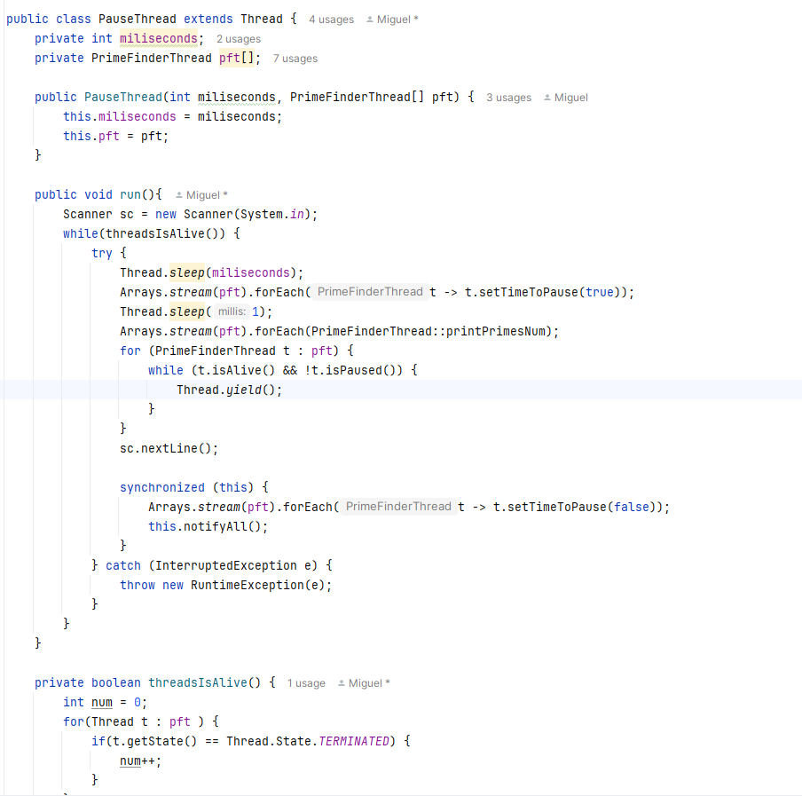
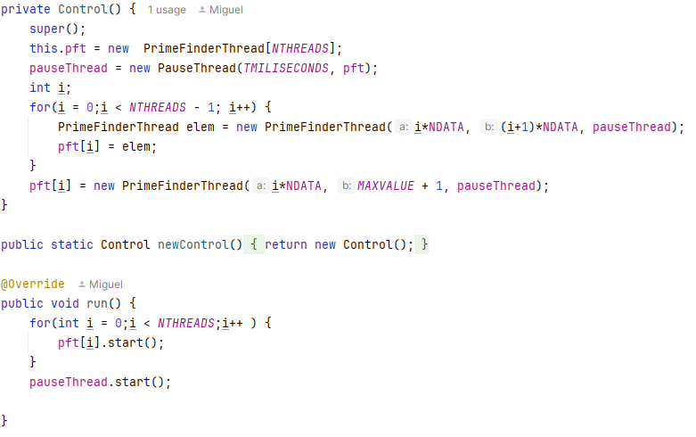
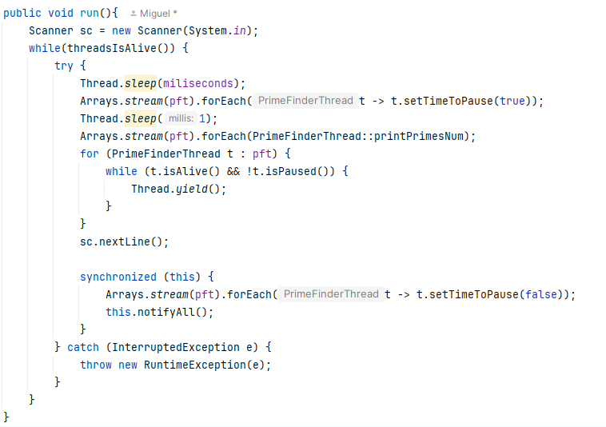
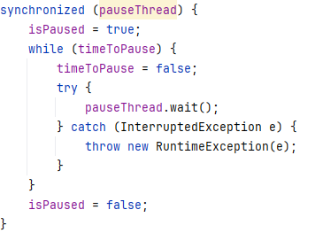
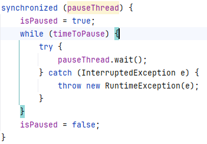
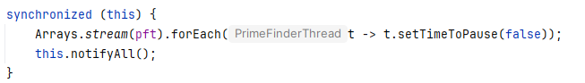

# Prime Finder
- Este proyecto funcionó como ejercicio de calentamiento para un laboratorio de la materia ARSW(Arquitectura de Software) de la
Escuela Colombiana de Ingenieria Julio Garavito, el laboratorio es el siguiente: [**Laboratorio Concurrencia 2**](https://github.com/miguelvanegas-c/Lab2ARSW)

## Desarrollo
El desarrollo fue el siguiente:
1. Se tomó el programa [**PrimeFinder**](https://github.com/ARSW-ECI/wait-notify-excercise).
2. Se realizó una modificación para que cada **t milisegundos:**
    - Se **pausen** todos los hilos trabajadores.
    - Se **muestre** cuántos números primos se han encontrado.
    - El programa **espere ENTER** para **reanudar**.

## Estrategia:

* Primero se implementó un nuevo hilo PauseThread, encargado de llevar un
temporizador para pausar al resto de hilos cuando fuera necesario.

* El hilo Control se encargó de inyectar la instancia de PauseThread a todos
los PrimeFinderThread y de iniciar sus ejecuciones. Una vez iniciados, cada
hilo realizaba su trabajo hasta que transcurrieran los milisegundos
especificados en Control.

* En ese momento, PauseThread modificaba un atributo volatile que contenía cada
PrimeFinderThread para notificarle que era momento de pausar. Cada hilo
verificaba periódicamente esta variable y, al detectar la señal, pausaba su
ejecución con wait() sobre la instancia de PauseThread (usada como monitor).

* Una vez todos los hilos estaban pausados, PauseThread imprimía el número de
primos que cada uno había encontrado, cambiaba la variable de control, y
ejecutaba notifyAll() sobre sí mismo para despertar a todos los hilos y que
reanudaran su ejecución.

!

* Como ajuste adicional, se implementó un mecanismo para garantizar que la
  impresión solo ocurriera cuando todos los hilos estuvieran completamente
  pausados. Cada PrimeFinderThread tiene una variable volatile que indica si
  está pausado, y PauseThread verifica todas estas variables antes de imprimir
  los resultados.

## Comentario

### Lock 
* Se usó el objeto PauseThread como monitor compartido para la sincronización. 

* En el primer caso se usó la variable que comparten los objetos PrimeFinderThread,
  mientras que en el segundo se usó this debido a que se hace directamente dentro del objeto
  PauseThread que comparten los hilos.

### Evitar lost wakeup y spurious wakeup

* Se evita el lost wakeup mediante una barrera de confirmación con la variable
  isPaused. Cada hilo marca isPaused = true ANTES de ejecutar wait(), y
  PauseThread verifica que TODOS los hilos tengan isPaused = true antes de
  ejecutar notifyAll(). Solo después de esta verificación, cambia timeToPause
  a false y notifica. Esto garantiza que ningún hilo llegue tarde al wait() y
  pierda la notificación.

* El spurious wakeup se protege usando el while en lugar de un if en la condición, 
  ya que el if puede causar que el hilo se despierte previo al notifyAll.

